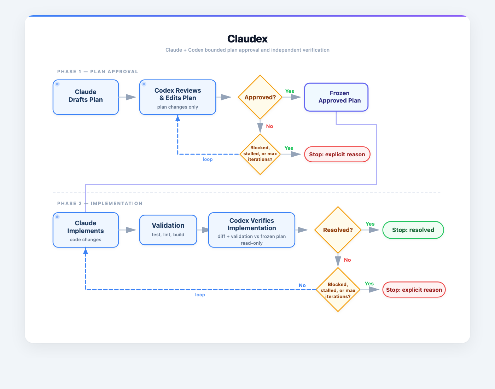

# Claudex

[](https://github.com/builtbylee/claude-codex-remediation-loop/actions/workflows/test.yml)
[](./LICENSE)

Claudex gives Claude Code an independent Codex reviewer so plans and implementations are checked before they ship.

| Agent | Best for | Result |
| --- | --- | --- |
| `codex-plan-review` | Getting a second opinion before approval | Codex reviews the plan and returns findings |
| `codex-remediation-loop` | Driving a risky plan all the way through planning and implementation | Codex refines and approves the plan, Claude implements against the frozen approved plan, Codex verifies the actual diff |

## Why Claudex

- independent review instead of self-approval
- bounded automation with a hard stop at 5 plan iterations and 5 implementation iterations
- Codex can rewrite the plan directly before any code work starts
- implementation is verified against the frozen approved plan, actual file changes, and validation output
- explicit failure modes: blocked, stagnating, max-iterations, review unavailable
- safe defaults: Codex edits the plan only; Claude edits code only; validation is controller-owned

## Install

```bash
curl -fsSL https://raw.githubusercontent.com/builtbylee/claude-codex-remediation-loop/main/install.sh | bash
```

Requirements:

- `python3`
- `claude` CLI installed and logged in
- `codex` CLI installed and logged in
- macOS or Linux shell environment

## Verify

In Claude Code:

1. run `/agents`
2. confirm these appear:
   - `codex-plan-review`
   - `codex-remediation-loop`
3. if they do not appear immediately, restart Claude Code once and run `/agents` again


## Remediation Loop Workflow



## Use

One-shot plan review:

```text
Use the codex-plan-review subagent to review /absolute/path/to/PLAN.md
```

Full two-phase remediation loop:

```text
Use the codex-remediation-loop subagent to run the remediation loop for /absolute/path/to/PLAN.md
```

Direct CLI:

```bash
python3 ~/.claude/tools/codex-remediation-loop/codex_remediation_loop.py loop \
  --plan /absolute/path/to/PLAN.md \
  --cwd /absolute/path/to/workspace \
  --max-iterations 5
```

## What Gets Installed

- `~/.claude/agents/codex-plan-review.md`
- `~/.claude/agents/codex-remediation-loop.md`
- `~/.claude/hooks/codex_plan_review.py`
- `~/.claude/tools/codex-remediation-loop/`
- automatic plan-review hook merged into `~/.claude/settings.json`

## Workspace Overrides

If validation auto-detection is wrong for a repo, add either:

- `.claude-codex-loop.json`
- `.claude/codex-remediation-loop.json`

Example:

```json
{
  "validation_commands": [
    "pnpm lint",
    "pnpm test",
    "pnpm build"
  ],
  "codex_model": "gpt-5.4",
  "claude_model": "opus"
}
```

## Safety Model

- Codex edits the plan only; it never edits code
- Claude implementer does not get shell access
- the approved plan is frozen before implementation starts
- if Claude mutates the frozen plan during implementation, the controller restores it and flags it as a regression
- failures are explicit; the system does not pretend a review happened
- review results are cached by content hash for one-shot plan review

## Uninstall

```bash
curl -fsSL https://raw.githubusercontent.com/builtbylee/claude-codex-remediation-loop/main/uninstall.sh | bash
```

Or locally:

```bash
./uninstall.sh
```

## Notes

- the installer is shell-based; Windows users would need WSL or a manual install path
- the remediation loop depends on both local CLIs working: `claude` and `codex`
